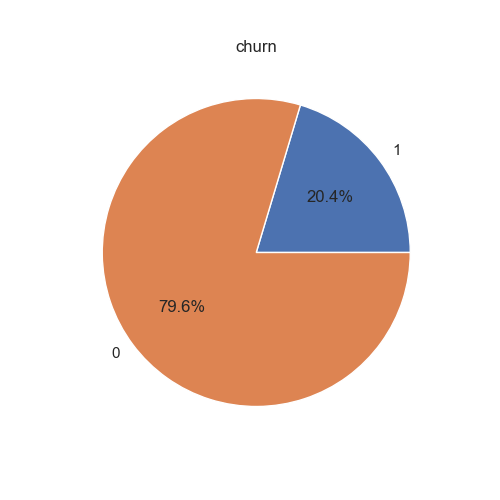
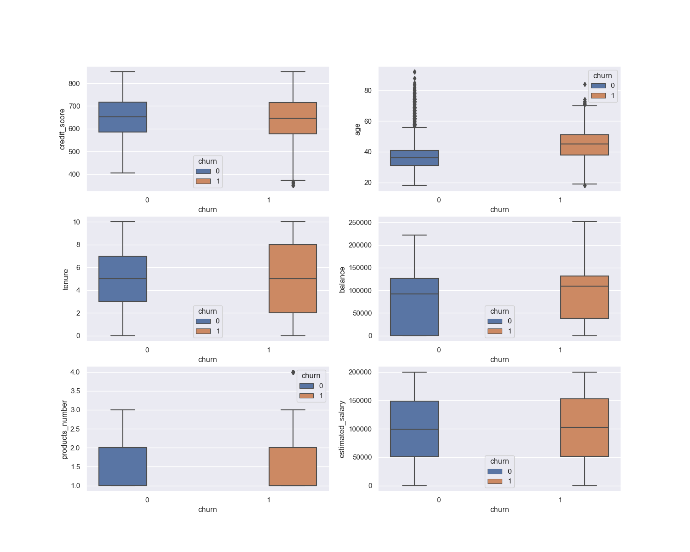
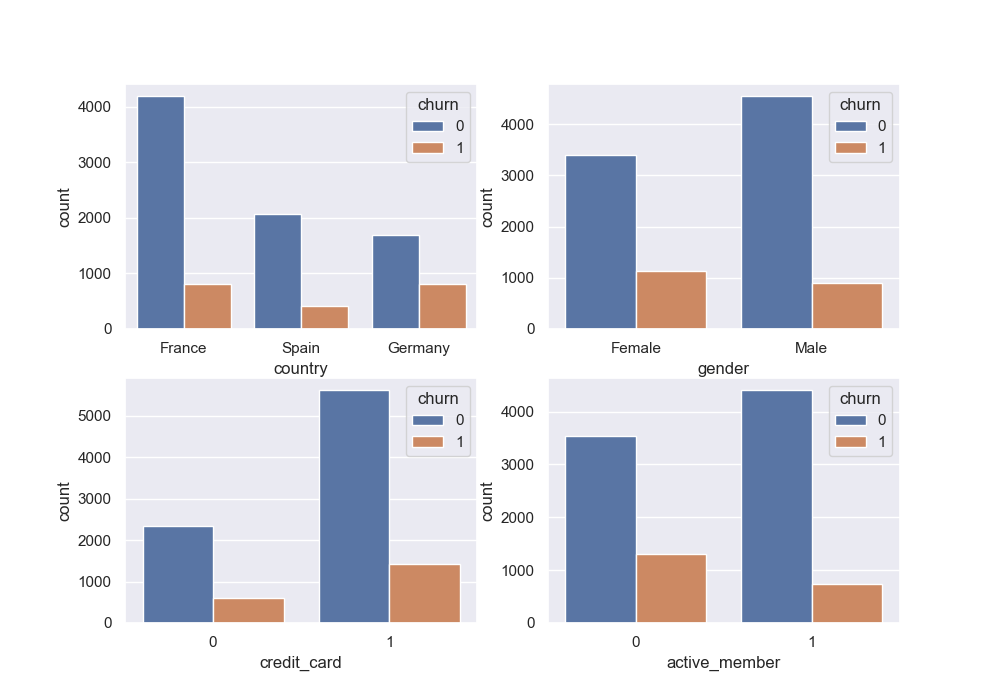

# Data Mining Project – Bank Customer

## Data description

### DataFrame.describe


    ```
             customer_id  credit_score country gender           age 
    count   1.000000e+04  10000.000000   10000  10000  10000.000000
    unique           NaN           NaN       3      2           NaN
    top              NaN           NaN  France   Male           NaN
    freq             NaN           NaN    5014   5457           NaN
    mean    1.569094e+07    650.528800     NaN    NaN     38.921800
    std     7.193619e+04     96.653299     NaN    NaN     10.487806
    min     1.556570e+07    350.000000     NaN    NaN     18.000000
    25%     1.562853e+07    584.000000     NaN    NaN     32.000000
    50%     1.569074e+07    652.000000     NaN    NaN     37.000000
    75%     1.575323e+07    718.000000     NaN    NaN     44.000000
    max     1.581569e+07    850.000000     NaN    NaN     92.000000
    -----------------------------------------------------------------
                  tenure        balance  products_number  credit_card  
    count   10000.000000   10000.000000     10000.000000  10000.00000
    unique           NaN            NaN              NaN          NaN
    top              NaN            NaN              NaN          NaN
    freq             NaN            NaN              NaN          NaN
    mean        5.012800   76485.889288         1.530200      0.70550
    std         2.892174   62397.405202         0.581654      0.45584
    min         0.000000       0.000000         1.000000      0.00000
    25%         3.000000       0.000000         1.000000      0.00000
    50%         5.000000   97198.540000         1.000000      1.00000
    75%         7.000000  127644.240000         2.000000      1.00000
    max        10.000000  250898.090000         4.000000      1.00000
    -----------------------------------------------------------------
           active_member  estimated_salary         churn
    count   10000.000000      10000.000000  10000.000000
    unique           NaN               NaN           NaN
    top              NaN               NaN           NaN
    freq             NaN               NaN           NaN
    mean        0.515100     100090.239881      0.203700
    std         0.499797      57510.492818      0.402769
    min         0.000000         11.580000      0.000000
    25%         0.000000      51002.110000      0.000000
    50%         1.000000     100193.915000      0.000000
    75%         1.000000     149388.247500      0.000000
    max         1.000000     199992.480000      1.000000
    ```

### Attributes Explain

因爲缺乏文件說明檔，所以以下是根據單字定義推測其屬性的意思。

- customer_id: 客戶的 ID

- credit_score: 客戶的信貸評分，一般介於 300~850 之間，其中

        Excellent: 800–850
        Very Good: 740–799
        Good: 670–739
        Fair: 580–669
        Poor: 300–579

- country: 未知，有可能是客戶所在國家或者銀行所在國家

- gender: 客戶的性別

- age: 客戶的年齡

- tenure: 客戶的貸款期限，單位未知，貸款分為短期貸款（1年內）和中長期貸款

- balance: 客戶目前戶頭內的金額

- products_number: 客戶的產品數量

- credit_card: 客戶是否持有金融卡，是:1，否:0

- active_member: 客戶是否爲活躍用戶，是:1，否:0

- estimated_salary: 客戶的預估薪酬，單位未知

- churn: 客戶是否流失，是:1，否:0

### Data Distributions

1. 客戶總流失率: 約 20.4%



2. 各屬性的流失率比較圖

連續型屬性: 由箱形圖觀察可知流失的客戶跟非流失的客戶相比，信貸評分稍低，年齡中位數稍高，貸款期限分佈較分散，戶頭內金額偏高，products_number 和 estimated_salary 看不出明顯差別。



類別型 / binary 屬性: 由對抗圖觀察可知流失的客戶比例較高的屬性爲，country 爲德國，性別爲女，不屬於活躍用戶的資料。



## Decision Tree Classifier

### The rules used to classify the data

1. 資料處理: 有將 country, gender 類別內的值映射到數字，且有將所有連續型屬性做 Standard Scaler

2. 設定 Parameter Grid:

```python
p_grid = {
    'criterion': ['entropy', 'gini'], 
    'splitter': ['best', 'random'], 
    'max_depth': [5, 7, 9], 
    'min_samples_leaf': [1, 3, 5], 
    'min_samples_split': [2, 3, 4], 
    'max_features': [6, 7, 8], 
    'random_state': [123]
}
```

3. 使用 GridSearchCV 且設定 cv=10 使用 10-fold cross validation 尋找最佳解

### Performance evaluation

```
Best parameters : {'criterion': 'gini', 'max_depth': 7, 
        'max_features': 7, 'min_samples_leaf': 3, 
        'min_samples_split': 2, 'random_state': 123, 
        'splitter': 'best'} 

Best score : 0.8584999999999999 

Classification report :
               precision    recall  f1-score   support

           0       0.88      0.97      0.92      7963
           1       0.78      0.47      0.58      2037

    accuracy                           0.86     10000
   macro avg       0.83      0.72      0.75     10000
weighted avg       0.86      0.86      0.85     10000
```

### Discussions or comments

觀察 classification report 中對 churn=1 的預測評鑑可得知 decision tree classifier model 在預測 churn=1 的表現普通。

我認爲可能是因爲從資料分析的各個對抗圖來看，並沒有找到明顯影響判斷 churn=0 或 churn=1 的因素，decision tree classifier model 對於深層規則的探索能力有限。

或者是因爲此份資料的目標屬性比例上有偏差，可以考慮資料增強的方法來增加準確度。

## Random Forest Classifier

### The rules used to classify the data

1. 資料處理: 有將 country, gender 類別內的值映射到數字，且有將所有連續型屬性做 Standard Scaler

2. 設定 Parameter Grid:

```python
p_grid = {
    'n_estimators': [50, 100, 120],
    'criterion': ['gini', 'entropy', 'log_loss'],
    'max_depth': [7, 8, 9],
    'max_features': [7, 8, 9],
    'min_samples_split': [3, 5, 7]
}
```

3. 使用 GridSearchCV 且設定 cv=10 使用 10-fold cross validation 尋找最佳解

### Performance evaluation

```
Best parameters : {'criterion': 'gini', 'max_depth': 9, 
        'max_features': 7, 'min_samples_split': 7, 
        'n_estimators': 120} 

Best score : 0.866 

Classification report :
               precision    recall  f1-score   support

           0       0.89      0.98      0.94      7963
           1       0.88      0.55      0.68      2037

    accuracy                           0.89     10000
   macro avg       0.89      0.76      0.81     10000
weighted avg       0.89      0.89      0.88     10000
```

### Discussions or comments

因爲 的預測效果普通，我想要使用 bagging 的方式增加準確度，我選擇嘗試 random forest classifier。

結果顯示在判斷 churn=1 的 f1-score 比 decision tree classifier 的高出 0.1，訓練所花的時間增加了半小時以上。

關於之後可以做的改進的方面，目前最佳超參數其中 n_estimators 的數值是 120 ，表示 random forest 長了 120 棵樹時得到了最佳結果，在我設定的 parameter grid 中是最高的數字，有可能再增加更高的參數會得到更好的結果。 

另外也可以參考金融會計相關的知識，瞭解信貸評分參考的因素來源還有評分機制，比對此資料屬性有無重複，並建構更適合金融相關資料預測的演算法。